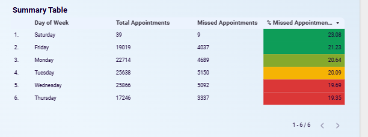
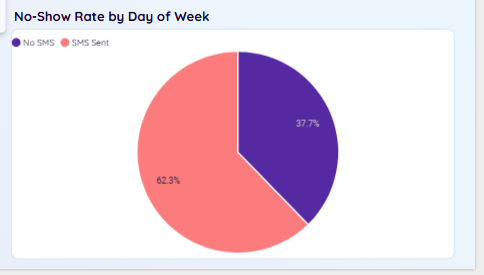
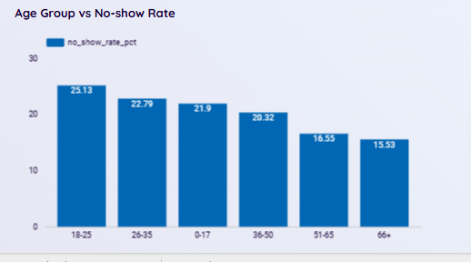
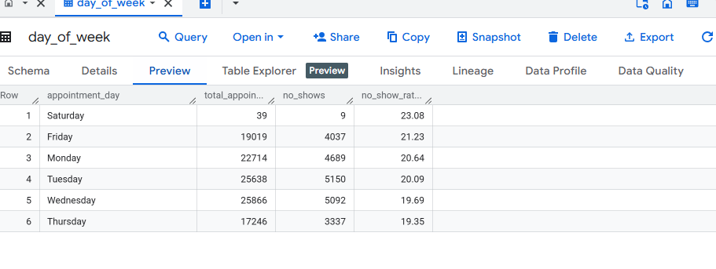

# 🏥 Patient No-Show Analysis – SQL + Looker Studio

This project analyzes a real-world dataset from Brazilian medical appointments to uncover patterns behind patient no-shows. Using SQL in BigInsight and visualized through Looker Studio, the goal is to provide actionable insights for improving patient attendance.

<strong>📑 Table of Contents</strong>

- [Project Overview](#project-overview)  
- [Key Questions](#key-questions) 
- [Dataset Description](#dataset-description)  
- [Data Cleaning](#data-cleaning) 
- [Exploratory Data Analysis (EDA)](#exploratory-data-analysis)  
- [SQL Techniques Used](#sql-techniques-used)  
- [Tools Used](#tools-used)
- [Key Business Insights](#key-business-insights)  
  - [Insight 1: Overall No-Show Rate](#insight-1-overall-no-show-rate)  
  - [Insight 2: Wait Time (Days Between Booking and Appointment)](#insight-2-wait-time-days-between-booking-and-appointment)  
  - [Insight 3: No-Show Rate by SMS Reminder (Unexpected Trend)](#insight-3-no-show-rate-by-sms-reminder-unexpected-trend)  
  - [Insight 4: No-Show Rate by Age Group ](#insight-4-no-show-rate-by-age-group)  
  - [Insight 5: Day of Week Patterns](#insight-5-day-of-week-patterns) 
<!-- - [Data Visualization / Dashboard](#data-visualization--dashboard)   -->
- [Recommendations](#recommendations)  
- [Challenges Faced](#challenges-faced)  
- [Conclusion](#conclusion)  
- [Next Steps / Future Work](#next-steps--future-work)  
- [Author & License](#author--license)

## Project Overview

This project explores a real-world healthcare dataset containing over 100,000 appointment records to identify the root causes of patient no-shows. By leveraging SQL for data cleaning and transformation, and conducting exploratory data analysis (EDA), the goal is to uncover patterns across demographics, scheduling behavior, and communication touchpoints. The outcome is to build actionable insights that healthcare providers can use to reduce missed appointments, improve operational efficiency, and enhance patient experience.

## Key Questions
- What days of the week have the highest no-show rates?

- Does receiving an SMS reminder reduce no-shows?

- Are younger patients more likely to miss appointments?

- Is there a correlation between wait time and no-shows?

- Do health conditions influence attendance?

## Dataset Description
- **Source**: [Kaggle - Medical Appointment No Shows](https://www.kaggle.com/datasets/joniarroba/noshowappointments)
- **Rows**: 110,000+records

| Table Name       | Description                       | 
|------------------|-----------------------------------|
| PatientId        | Unique identifier for the patient | 
| AppointmentID    | Unique appointment ID | 
| Gender           | Male or Female | 
| ScheduledDay     | Date the appointment was scheduled | 
| AppointmentDay   | Actual day of the appointment |
| Age	           | Age of the patient |
| Neighbourhood	   | Location of the clinic |
| Scholarship	   | 1 = enrolled in welfare program |
| Hypertension	   | 1 = has hypertension |
| Diabetes	       | 1 = has diabetes |
| Alcoholism	   | 1 = recorded as alcoholic |
| Handcap	       | 0–4 (degree of disability) |
| SMS_received	   | 1 = patient got an SMS reminder |
| No-show	       | 1 = didn’t show up, 0 = came to the appointment |

## Data Cleaning 
✔️ Removed duplicates

✔️ Handled nulls and incorrect dates

✔️ Normalized column types

✔️ Created views for clean analysis

## Exploratory Data Analysis 

✅ Key Findings
| Metric           | Insights                      | 
|------------------|-----------------------------------|
| 📅 Day of Week   | Monday, Tuesday, Wednesday, and Friday had high no-show rates | 
| 📲 SMS Reminder  | Surprisingly, those who received SMS reminders had more no-shows | 
| ⏳ Wait Time     | Longer wait time = higher no-show rate| 
| 🧒 Young Adults  | Most at-risk age group for missing appointments | 
| 🩺 Health Conditions   | Not strong predictors of no-shows — behavior > medical|
| 🏥 Clinic Location  | No-show rates vary by neighborhood |

## SQL Techniques Used

- Common Table Expressions (CTEs)

- CASE statements for bucketing and formatting

- Aggregations, groupings, and joins

- Derived metrics (no-show rate, wait time, age groups)

- Conditional formatting for visuals

## Tools Used
- Google BigQuery for data cleaning and transformation

- Looker Studio for visualization

## Exploratory Data Analysis (EDA)

- Monthly transaction and subscription volume trends  
- Distribution of users by plan and user type  
- Outlier detection in revenue and goal target amounts  
- Correlation between target amount and transaction frequency

## Key Business Insights

### Insight 1: Overall No-Show Rate 
**Purpose:** Measures scale of the problem

**Insight:**  
- Longer wait times correlated with higher no-show rates.
- High no-show rates occurred on Monday, Tuesday, Wednesday, and Friday.
- Saturday had the highest no-show percentage (23%) but a very small sample size — only 39 appointments.

### Insight 2: Wait Time (Days Between Booking and Appointment)

**Purpose:** Measure the number o waiting days between scheduled date and appointment date

**Insight:**  
- Longer wait times correlated with higher no-show rates.
- Patients who waited more than 7 days had nearly double the no-show rate (28%) compared to those with shorter wait times.

### Insight 3: No-Show Rate by SMS Reminder (Unexpected Trend)

**Purpose:** Tests effectiveness of SMS outreach and Compare those who got reminders vs. not

**Insight:**  
- Suprisingly 62.3% of patients who received SMS reminders missed their appointments vs 37.7% for those who didn’t receive SMS.
- Indicates that the current reminder strategy may not be effective or may even cause complacency.

### Insight 4: No-Show Rate by Age Group 

**Purpose:** Identifies at-risk age groups

**Insight:**  
- Young adults exhibited the highest no-show rates, suggesting age-related behavioral trends.
- This age group may require targeted strategies to improve appointment adherence.
- Older adults (65+) had the lowest no-show rate (15.3%), indicating a potentially
different set of factors influencing their behavior.
- This age group may be a good target for outreach and engagement efforts.

### Insight 5: Day of Week Patterns

**Purpose:** Estimate ROI using total revenue minus assumed operating cost.

**Insight:**  
- High no-show rates occurred on Monday, Tuesday, Wednesday, and Friday.
- Saturday had the highest no-show percentage (23%) but a very small sample size — only 39 appointments.
- This may indicate a scheduling bias or other factors at play.
- Further investigation is needed to understand these patterns.

## Data Visualization / Dashboard

A Looker Studio dashboard was created to summarize:
- Overall No-Show Rate	i.e % of total appointments missed
- No-Show Rate by Day of Week	i.e % missed per weekday
- No-Show Rate by Age Group i.e	% missed by age segments
- No-Show Rate by SMS Reminder	i.e Compare those who got reminders vs. not 
- No-Show Rate by Wait Time Bracket i.e	% missed based on wait duration
- Summary Table 

https://www.loom.com/share/9c4bf82adcf045fd9631860c1b53e5db?sid=8b21dc54-17ed-4bf1-8098-f982c4a33701

## Recommendations

Based on the analysis, I recommend:

1. Shorten wait times between booking and appointments
2. Test new SMS formats (e.g., conversational, emoji-rich, personalized)
3. Target young adults with behaviorally informed reminders or incentives
4. Add filters like day-of-week when overbooking to reduce loss
5. Invest in deeper behavioral research, not just medical profiling
6. Send SMS reminders to all patients, ideally 1 day before.
7. Consider offering flexible scheduling options for young adults

## Challenges Faced

- Date Formatting: ScheduledDay and AppointmentDay required conversion and timezone alignment.
- Imbalanced Data: “Show” vs. “No-show” distribution was uneven, affecting analysis accuracy.
- Limited Medical Context: Binary health conditions lacked detail (e.g. severity, treatment).
- Tool Limitations: Looker Studio (web version) lacked Top N filters and flexible grouping options.
- Outliers: Unusual values (e.g. age 0 or 115, extreme wait times) required cleaning or exclusion.

## Next Steps / Future Work

- Model Deployment: Build and deploy a no-show prediction model using classification algorithms.
- Feature Engineering: Incorporate external data (e.g., weather, traffic, holidays) and patient behavior (e.g., appointment history, wait time tolerance).

# Conclusion

This analysis provided valuable insights into patient appointment behaviors, highlighting key factors influencing no-shows such as long wait times, lack of SMS reminders, and certain demographic and medical conditions. By identifying patterns across neighborhoods, age groups, and appointment schedules, healthcare providers can take proactive steps to reduce missed appointments and improve resource planning. These findings lay the foundation for building predictive models and implementing targeted interventions to enhance patient engagement and operational efficiency. 

## Author & License

This project was created as part of a professional portfolio to demonstrate practical financial analytics using SQL & Power BI.

<!-- - TikTok: [@](https://www.tiktok.com/@) -->
- GitHub: [https://github.com/mimipeshy](https://github.com/mimipeshy)    
- LinkedIn: [Peris Ndanu ](https://www.linkedin.com/in/peris-ndanu)  

© 2025 | Peris Ndanu | Data Analytics Portfolio| 